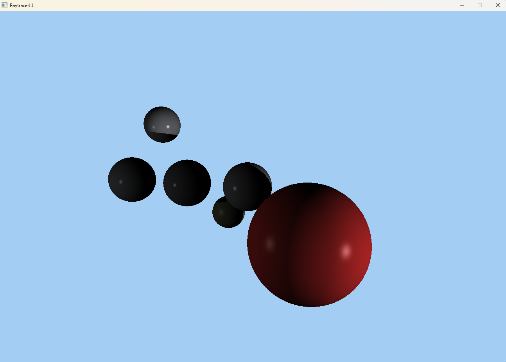

# Proyecto Raytracer

Raytracer por CPU escrito en Zig con raylib. Renderiza esferas con reflexión
difusa y especular (modelo de Phong) y sombras proyectadas entre objetos,
sobre el código base proporcionado en el curso.

Diego Gonzalez — 24170
Universidad del Valle de Guatemala

## Resultado



La esfera roja se interpone entre la luz principal y la esfera del centro, así
que le borra el brillo especular y le apaga el lado derecho. Las dos esferas de
la izquierda, a las que nada les tapa la luz, sí conservan su punto de brillo.

## Compilar y ejecutar

```sh
zig build run -Doptimize=ReleaseFast
```

`ReleaseFast` importa: en modo Debug el trazado va varias veces más lento.

Requiere Zig 0.16.0. La dependencia de raylib queda fijada en `build.zig.zon`,
así que `zig build` la descarga sola.

## Controles

| Tecla | Acción |
| ----- | ------ |
| `A` / `D` | Rotar la cámara horizontalmente |
| `W` / `S` | Rotar la cámara verticalmente |
| `P` | Guardar una captura en `render.png` |
| `ESC` | Salir |

## Cómo funciona

Por cada píxel se lanza un rayo desde la cámara. Si toca una esfera, el color
del píxel sale de sumar tres cosas por cada luz de la escena.

### Reflexión difusa

Es la luz que una superficie mate reparte por igual en todas direcciones. Su
intensidad depende solo del ángulo con el que la luz pega en la superficie:

```zig
const light_dir = light.Position.subtract(hit.Punto).normalize();
const diffuse_intensity = @max(0.0, light_dir.dotProduct(hit.Normal)) * light.Intensity;
```

El producto punto entre la normal y la dirección hacia la luz da el coseno del
ángulo entre ambas — la ley del coseno de Lambert. El `@max(0.0, ...)` corta los
valores negativos, que corresponden a la cara de la esfera que mira al lado
contrario de la luz.

### Reflexión especular

Es el brillo concentrado de una superficie pulida, y a diferencia del difuso sí
depende de dónde está parado el observador:

```zig
const reflection_dir = reflect(light_dir, hit.Normal);
const specular_intensity = std.math.pow(
    f32,
    @max(0.0, reflection_dir.dotProduct(view_direction)),
    mat.Especular,
) * light.Intensity;
```

`reflect` espeja el vector que apunta a la luz sobre la normal (`R = 2(N·I)N − I`),
dando la dirección hacia donde rebota. El producto punto contra la dirección a la
cámara mide qué tanto se está mirando justo por donde salió ese rebote, y el
exponente `mat.Especular` concentra el resultado: entre más alto, más pequeño y
definido el punto de brillo.

### Sombras

Antes de acumular la contribución de una luz se lanza un segundo rayo desde el
punto de impacto hacia esa luz. Si en el camino se topa con otro objeto, la luz
no llega y se descarta:

```zig
const shadow_origin = origin.add(light_dir.scale(shadow_bias));

for (objects) |object| {
    const hit = object.intersect(shadow_origin, light_dir) orelse continue;
    if (hit.Distancia < light_distance) return true;
}
```

Dos detalles hacen que esto funcione. El primero es el sesgo: el rayo nace justo
sobre la superficie de una esfera, así que sin despegarlo un poco vuelve a
intersecar esa misma esfera a distancia casi cero y todo queda en sombra, con un
moteado sucio característico (*shadow acne*). El segundo es la comparación de
distancias: no basta con que el rayo tope algo, ese algo tiene que estar *entre*
el punto y la luz, no más allá de ella.

## Rendimiento

El trazado se reparte entre todos los núcleos disponibles. Los hilos se sincronizan
con un contador atómico del que cada uno toma la siguiente fila libre, de modo que
ninguno se queda ocioso si le tocó una banda de puro cielo mientras otro trabaja en
la zona con esferas. El volcado final al `Image` de raylib queda en un solo hilo
porque `current_color` del framebuffer es estado compartido.

## Estructura

| Archivo | Contenido |
| ------- | --------- |
| `src/main.zig` | Escena, bucle principal, trazado de rayos y sombreado |
| `src/raytracer.zig` | Tipos base: `Material`, `Light`, `Intersect` |
| `src/sphere.zig` | Intersección rayo-esfera |
| `src/formas.zig` | Unión de tipos de figura |
| `src/camera.zig` | Cámara y `lookAt` |
| `src/framebuffer.zig` | Buffer de color y volcado a pantalla |
| `src/cute_colors.zig` | Colores en formato HTML en tiempo de compilación |
